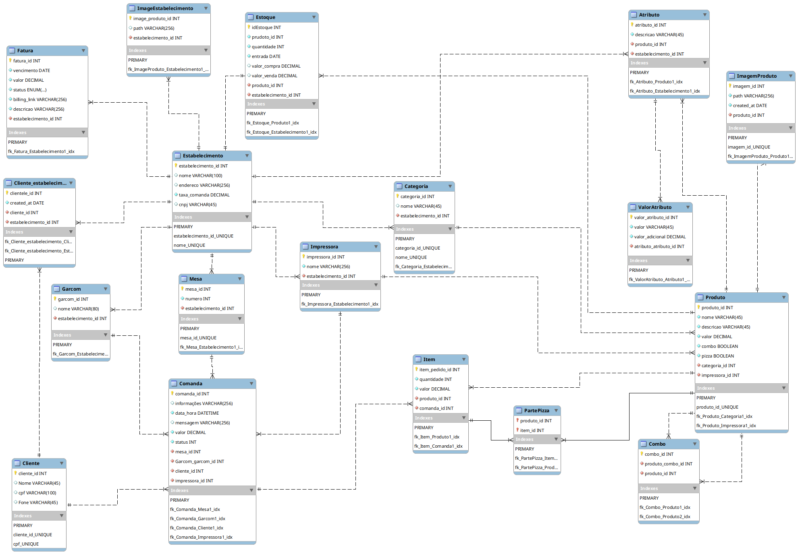

# TMenu
Repositório para o levantamento de informações dos requisitos iniciais da primeira versão do Tmenu.

# O que é?
 - Documento de requisitos da TMenu, plataforma de cardápio e comanda digital para bares e restaurantes.

# Objetivos
- Proporcionar ao cliente a liberdade de acessar o menu(cardápio) de bares e restaurantes por meio de seu smartphone, capturando com sua câmera o qrcode da plataforma disponibilizado nas mesas. Também ajudará os estabelecimentos a reduzir custos operacionais e otimizar o atendimento aos clientes. 

# Tipos de aplicações
- Painel Administrativo para a equipe tmenu (aplicação web com foco na navegação desktop)
- Painel Administrativo para os estabelecimentos (aplicação web com foco na nevegação desktop)
- Cardápio Digital para os clientes dos estabelecimentos (aplicação web com foco na navegação mobile)

# Requisitos
 - Cliente do estabelecimento
    - Conectar à rede WIFI do estabelecimento com qrcode
    - Ter acesso ao menu e as opções do sistema a partir do escaneamento do qrcode
    - O cliente deve se cadastrar no TMenu tendo opções de criação de suas credenciais por meio de APIs de login de redes sociais.
    - O cliente deve cadastrar cpf, nome e telefone
    - Fazer pedidos pelo sistema
    - Ver o detalhamento do pedido quando desejar
    - Pedir a conta pelo sistema

 - Estabelimento cliente do TMenu

    Vendas
    - Receber os pedidos de cada mesa
    - 
    - 

    Administração
    - Fazer cadastro e login na plataforma
    - Cadastrar, editar e excluir Garçom
    - Cadastrar, editar e excluir  categorias de produtos
    - Cadastrar, editar e excluir  produtos
    - Cadastrar, editar e excluir mesas
    - Configurar regras de pagamento para o cliente, possibilidade de cobrar 10%, cobrar por comanda ou por mesa
    - Gerar relatórios de vendas
    - Acompanhar faturamento da plataforma (Quanto vai pagar para o tmenu)
    - 

- TMenu
    - Gerar PDFs pra serem impressos
    - Direcionar pedidos para a impressora correspondente à categoria de produto ou para o caixa
    - Armazenar histórico de vendas do estabelecimento

- TMenu Administrador
    - Exibir histórico de vendas de cada estabelecimento
    - Fechar fatura de cliente(Estabelecimento)

Em breve, mais atualizações...

# Modelo Entidade Relacionamento

# Definições de Requisitos

- Requisistos Funcionais Estabelecimento
    
    - RF01 Fazer cadastro na plataforma.
    O estabelecimento deverá poder fazer seu cadastro na plataforma TMenu, informando seus dados:
    Responsável, CNPJ/CPF do responsável, Endereço e o que mais for relevante, além de criar um nome de usuário e um senha. Outras opções de criação de credenciais podem ser usadas.
    
    - RF02 Fazer Login na plataforma.
    O responsável deve poder fazer login na plataforma com as credenciais cadastradas, para ter acesso ao recursos do TMenu. Ao responsável deve ser dada a opção de recuperar sua credenciais caso as tenha perdido.
    
    - RF03 O estabelecimento deve poder cadastrar funcionários, com nome e função, que terão acesso aos recursos no TMenu de acordo com sua função. Esses registros poderão ser editados e excluidos da plataforma pelo estabelecimento comforme sua necessidade.
    
    - RF04 O estabelecimento deve poder cadastrar categorias de produtos de acordo com seu negócio assim como editar e excluí-las conforme sua necessidade.
    
    - RF05 O estabelecimento deve poder cadastrar produtos de acordo com seu modelo de negócio podendo editar e excluir conforme sua necessidade, aos produtos deve ser possível atribuir categorias, atributos e criar combos com dois ou mais produtos distintos, assim como com suas possíveis variações.
    
    - RF06 O estabelecimento deve poder cadastrar mesas, que terão uma numeração especifica e um link de acesso ao menu. Cada mesa pode ou não se relacionar com um funcionário (garçons). Em cada mesa pode ser realizado um ou mais pedidos simultâneos. 

    - RF07 O estabelecimento deve poder gerar relatórios de operações realizadas na plaforma com filtros que mostrem a movimentação por periodo, por mesa e por cliente.
    

- Requisistos Funcionais Cliente do estabelecimento

    - RF08 O cliente deve poder acessar o menu do estabelecimento por meio do escanemento de qrcode previamente criado a partir da url da respectiva mesa do estabelecimento.

    - RF09 O cliente deve poder se cadastrar no TMenu por meio de API de login das redes mais utilizadas.

    - RF10 O cliente deve poder adicionar a seu cadastro, seu nome, cpf e tefone, antes de efetuar seu primeiro pedido.
    
    - RF11 O cliente deve poder adicionar itens à sua sacola de forma a permitir que realize um pedido com os itens escolidos.

    - RF12 O cliente deve poder finalizar seu pedido, solicitando o fechamento da conta de forma automática, sendo informado que o funcinário do estabelecimento trará a conta para o seu pagamento.

- Requisistos Funcionais Administração

   

